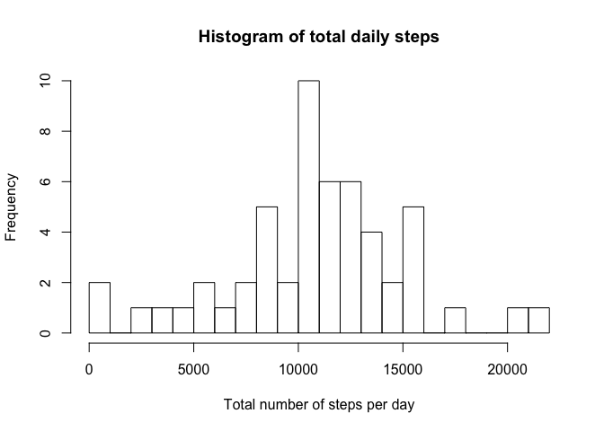
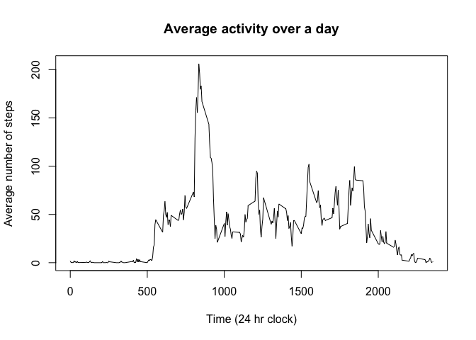
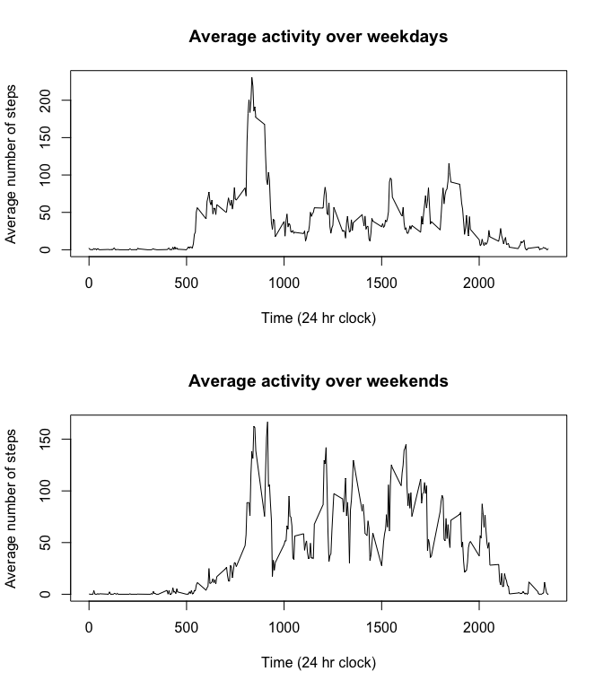

# Reproducible Research: Peer Assessment 1

## Loading and preprocessing the data
Read the data in using read.csv

```r
setwd("~")
activity <- read.csv("activity.csv")
```

## What is mean total number of steps taken per day?

First clean the data to remove the NA values  
Then run a tapply loop to provide sums of steps per date (which is by default a factor variable)  
Histogram of the sums is produced (without the NA values) using an arbitrary 20 bins to group the data


```r
cleanactivity <- activity[complete.cases(activity),]
sum <- tapply(cleanactivity$steps, cleanactivity$date, sum, na.rm = TRUE)
hist(sum, breaks = 20, xlab = "Total number of steps per day", main = "Histogram of total daily steps")
```

 

Next the mean and median are calculated

```r
mean(sum, na.rm = TRUE)
```

```
## [1] 10766.19
```

```r
median(sum, na.rm = TRUE)
```

```
## [1] 10765
```

## What is the average daily activity pattern?
First the average activity for each 5 minute interval must be calculated  
This first requires a conversion of the interval variable to a factor then a tapply loop to calculate the mean per 5 minute interval  
This is then plotted after a little cleanup so that the x axis reflects the time rather than the number in the list

```r
interval <- as.factor(cleanactivity$interval)
daily <- tapply(cleanactivity$steps, interval, mean, na.rm = TRUE)
forplot <- as.data.frame(cbind(as.integer(rownames(daily)), daily))
names(forplot) <- c("Time", "Steps")
plot(forplot, type = "l", main = "Average activity over a day", xlab = "Time (24 hr clock)", ylab = "Average number of steps")
```

 

We want the time of day that the maximum activity happens so we ask for the subset of the data where the steps recorded are equal to the maximum (in case there are more than 1 with equal values) and record the time this occurs to the variable maxtime.  
The printed value is then formatted to 24 hour time to make it nicer to look at

```r
names(daily) <- "steps"
maxtime <- forplot[forplot[,2] == max(daily), 1]
formatC(maxtime, width = 4, flag = 0)
```

```
## [1] "0835"
```

## Imputing missing values

We need to go back to the original data to find out how many NA values there are
For each of these rows we can insert the mean for that interval in the day

```r
sum(is.na(activity$steps))
```

```
## [1] 2304
```

```r
activity2 <- activity
for(i in 1:17568) {
        if(is.na(activity2$steps[i])) {
                a <- activity2$interval[i]
                b <- subset(forplot, forplot$Time == a)
                activity2$steps[i] <- b$Steps
        }
}
```
Now we recalculate the sums through the same tapply loop as in the first example and graph on a histogram

```r
sum2 <- tapply(activity2$steps, activity2$date, sum, na.rm = TRUE)
hist(sum, breaks = 20, xlab = "Total number of steps per day", main = "Histogram of total daily steps")
```

 

Next the mean and median are calculated and compared with the originals

```r
matrix(c(mean(sum, na.rm = TRUE), median(sum, na.rm = TRUE), mean(sum2, na.rm = TRUE), median(sum2, na.rm = TRUE)), nrow = 2, ncol = 2, dimnames = list(c("Mean", "Median"), c("Without NA", "Imputed NAs")))
```

```
##        Without NA Imputed NAs
## Mean     10766.19    10766.19
## Median   10765.00    10766.19
```

## Are there differences in activity patterns between weekdays and weekends?

First we need to reconfigure the date column of the table with imputed values using as.Date  
Then we assign a weekday variable using the weekdays function  
Through a for loop these weekdays are changed to simply "Weekend" or "Weekday" and then converted to a factor variable  
The plots are then created


```r
activity2$date <- as.Date(activity2$date)
activity2$weekday <- weekdays(activity2$date)
for(i in 1:17568) {
        if(activity2$weekday[i] == "Saturday" | activity2$weekday[i] == "Sunday") {
                activity2$weekday[i] <- "Weekend"
        } else {
                activity2$weekday[i] <- "Weekday"
        }
}
activity2$weekday <- as.factor(activity2$weekday)
interval <- as.factor(activity2$interval)
weekdaymeans <- tapply(activity2$steps, list(interval, activity2$weekday), mean, na.rm = TRUE)
forplot2 <- as.data.frame(cbind(as.integer(rownames(weekdaymeans)), weekdaymeans))
names(forplot2) <- c("Time", "Steps_Weekday", "Steps_Weekend")
par(mfrow = c(2,1))
plot(forplot2[,1:2], type = "l", main = "Average activity over weekdays", xlab = "Time (24 hr clock)", ylab = "Average number of steps")
plot(forplot2[,c(1,3)], type = "l", main = "Average activity over weekends", xlab = "Time (24 hr clock)", ylab = "Average number of steps")
```

 
